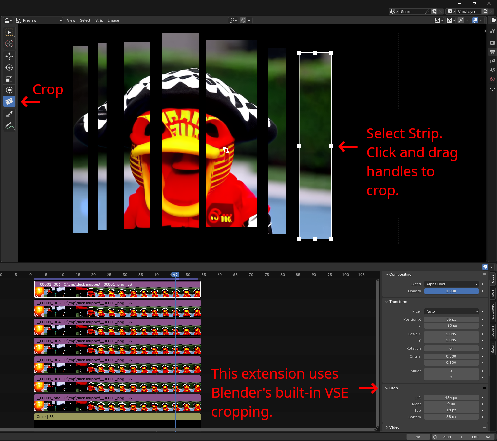
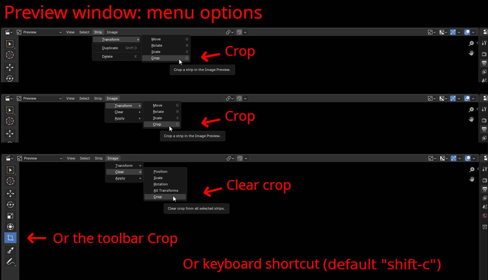

# BL Easy Crop

BL Easy Crop lets you click and drag handles to crop in Blender's Visual Sequence Editor / preview window.
With this extension Blender's built-in crop looks and behaves a bit more like the other transforms: rotate, scale, move and transform.
It can be accessed via the preview window toolbar, menus or keyboard shortcut (default "Shift + C").

Credit to the old https://github.com/doakey3/VSE_Transform_Tools for numerous bits of help while trying to get this thing to work.

Also credit to nickberckley for gizmo tips and custom icon assistance https://github.com/nickberckley

 

Quick breakdown of menu options, etc:

 

Crops can be animated. Turn on Auto Keying and drag a handle, and the keyframes are inserted for you.

## Compatibility

- Blender 4.4+
- Works with all strip types that support cropping

## Installation

**From Blender.** Edit > Preferences > Get Extensions, search for "BL Easy Crop",
and press Install.

**From a zip.** Download the latest
[zip](https://github.com/usrname0/BL_EasyCrop/releases) and install it as an
extension: Edit > Preferences > Add-ons, then the drop-down arrow at the top
right > Install from Disk, and pick the zip.

## Troubleshooting

It should just work right away after installing.  If the addon doesn't appear after installation:
1. Make sure you're using Blender 4.4 or newer
2. Check the console for any error messages
3. Try restarting Blender after installation